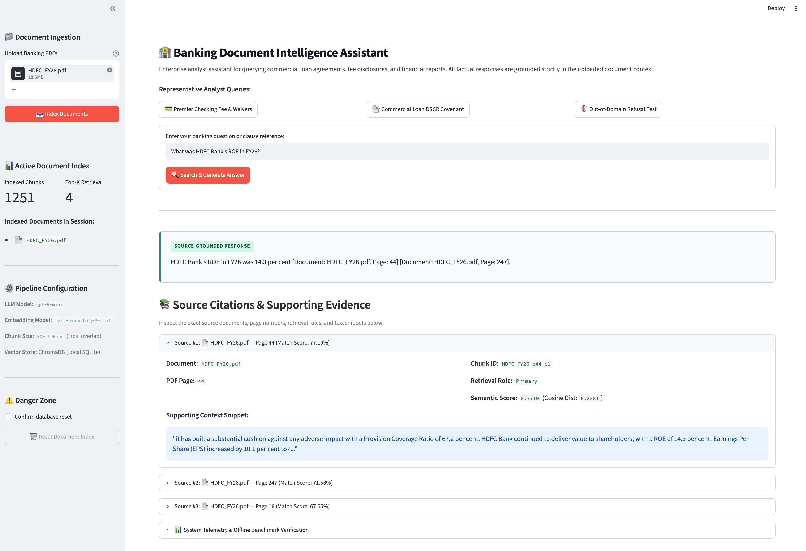
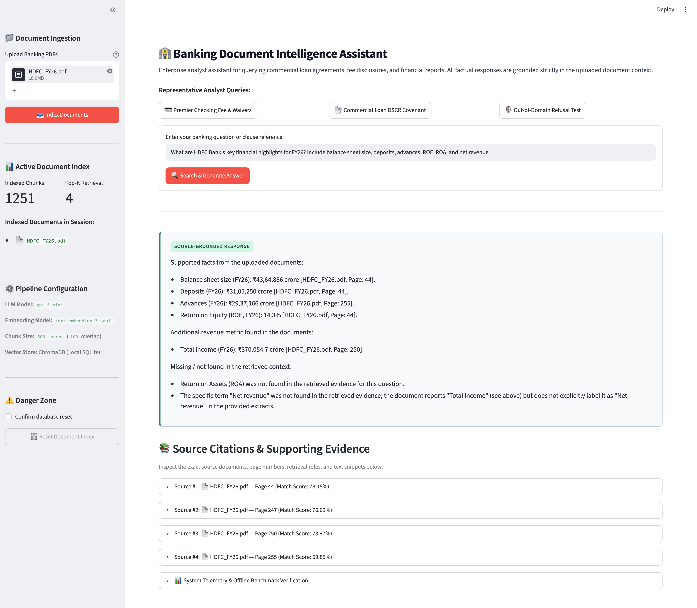
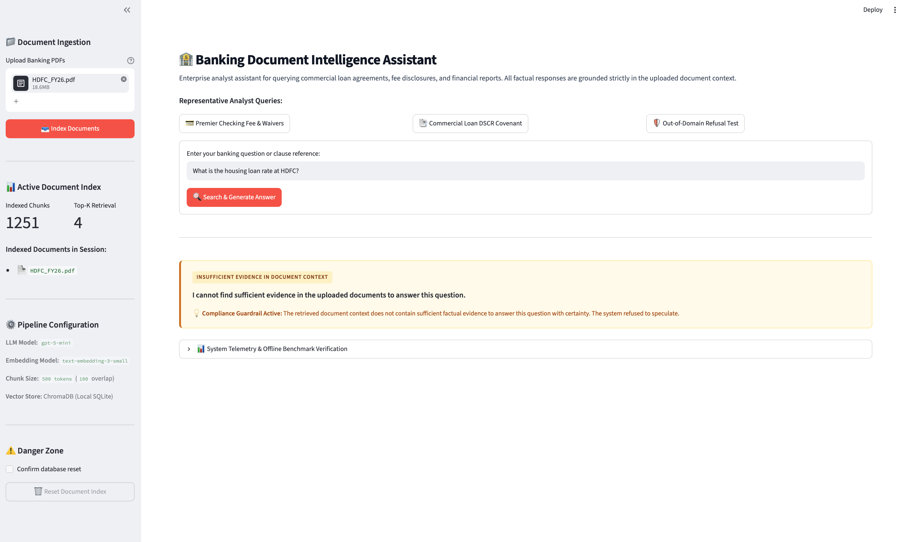
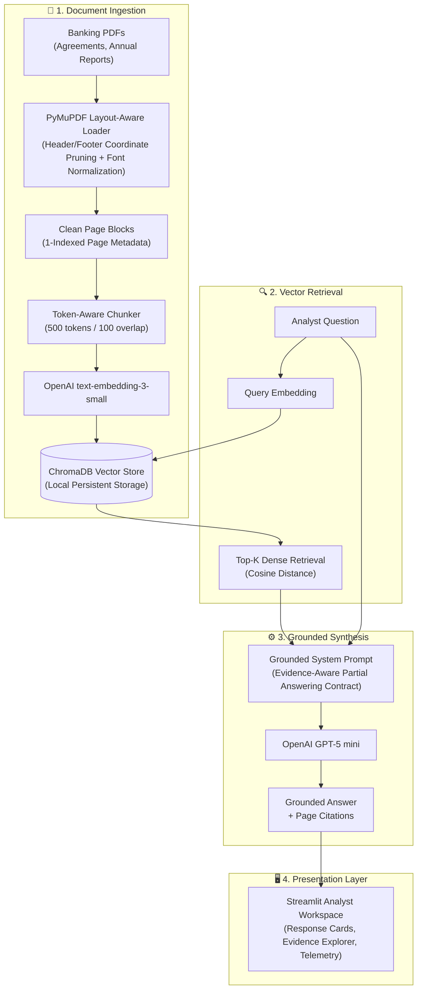

# 🏦 Banking Document Intelligence Assistant

A source-grounded RAG assistant for analyzing banking documents with page-level citations and evidence-aware answers.

- **Live Application**: Live Demo — (https://banking-document-intelligence.streamlit.app/)
- **Repository**: `https://github.com/your-username/banking-document-intelligence-assistant`

---

## 📷 Screenshots

### Grounded Answer


### Evidence-Aware Partial Answer


### Insufficient Evidence


---

## 💼 Business Problem

Banking analysts work with lengthy annual reports, agreements, fee schedules, and regulatory documents. Finding, validating, and citing a specific fact can require extensive manual document search. 

General-purpose conversational AI systems can hallucinate or fail to provide exact page-level provenance. In banking workflows, every financial figure or covenant term must be traceable to a specific document and page number, and the system must explicitly decline to answer when evidence is missing.

---

## 💡 Solution

The **Banking Document Intelligence Assistant** is a document-grounded Retrieval-Augmented Generation (RAG) system designed for financial analysts. Users can upload banking PDFs—such as credit agreements, fee disclosures, and annual financial reports—and query them through a clean web workspace.

The application uses **PyMuPDF** for layout-aware text extraction, **ChromaDB** for local dense vector search, and **OpenAI text-embedding-3-small** to index token-aware chunks with strict page-level metadata. When answering questions, **OpenAI GPT-5 mini** generates grounded responses with exact page citations (`[Document: filename, Page: X]`). For multi-metric queries where only a subset of facts is present, the system provides evidence-aware partial answers while explicitly declaring missing items, and returns a standardized insufficient-evidence response when no relevant evidence exists.

---

## 🏗️ Architecture



---

## ✨ Key Features

- **Multi-Document PDF Ingestion**: Batch upload and indexing with scanned-document detection.
- **Layout-Aware Page-Level Extraction**: Block coordinate sorting that preserves natural reading order.
- **Persistent Chroma Vector Search**: Embedded vector database storing dense embeddings locally with metadata filtering.
- **Page-Level Source Citations**: Every factual statement is paired with `[Document: filename, Page: X]` references.
- **Evidence-Aware Partial Answers**: Reports verified metrics with citations while explicitly identifying any requested figures missing from the context.
- **Insufficient-Evidence Guardrail**: Refuses unsupported or out-of-domain queries with an explicit compliance disclaimer.
- **API Error Separation**: Programmatically separates network/API timeouts from document-level refusals.
- **Deterministic Rupee Font Normalization**: PDF extraction-layer remapping for legacy symbol fonts (`ITFRupee`, `Rupee` $\to$ `₹`) without altering numeric values.
- **Offline Evaluation Benchmark**: Deterministic 15-question test suite to benchmark retrieval hit rates and refusal accuracy.

---

## 📊 Evaluation

The system was evaluated against a deterministic **15-question offline development benchmark** (`eval/eval_questions.json`) covering direct factual lookups, numerical values, conditional loan covenants, multi-chunk queries, and deliberate out-of-domain questions across sample banking documents.

- **Total Questions**: `15` (`11` answerable, `4` unanswerable)
- **Retrieval Source Hit Rate**: **100.0%** (11/11 answerable)
- **Retrieval Page Hit Rate**: **100.0%** (11/11 answerable)
- **Correct Refusal Rate**: **100.0%** (4/4 unanswerable)
- **Overall Answer Match Rate**: **86.67%** (13/15)

> [!NOTE]
> These are results from a small offline development benchmark, not production accuracy guarantees.

---

## 🔬 Retrieval Experiment

A focused experiment was conducted on the 15-question benchmark to assess the impact of retrieval depth ($K=2$ vs $K=4$ vs $K=6$):

| Configuration | Top-K | Source Hit Rate | Page Hit Rate | Correct Refusal Rate | Answer Match Rate |
| :--- | :---: | :---: | :---: | :---: | :---: |
| **Lower Context** | $K=2$ | 100% (11/11) | 100% (11/11) | 100% (4/4) | 86.67% (13/15) |
| **Baseline** | $K=4$ | 100% (11/11) | 100% (11/11) | 100% (4/4) | 86.67% (13/15) |
| **Higher Context** | $K=6$ | 100% (11/11) | 100% (11/11) | 100% (4/4) | 86.67% (13/15) |

Changing retrieval depth alone did not improve answer quality on this benchmark, so $K=4$ was retained as the practical baseline for context sufficiency and token economy.

---

## 📈 Real-World HDFC Stress Test

The ingestion pipeline was evaluated against a real-world, 629-page annual report (`HDFC_FY26.pdf`, $17.75$ MB, $1.81$M characters):

- **Total Pages**: 629 PDF pages.
- **Pages with Extractable Text**: 628 / 629 pages (99.84%) with zero OCR required (exactly 1 blank divider page).
- **Chunks Generated**: 1,246 chunks (`chunk_size = 500`, `chunk_overlap = 100`, `filter_headers_footers = True`).
- **Average Chunk Size**: 392.64 tokens *(1,655.21 characters)*.
- **Metadata Integrity**: 100.00% (1,246 / 1,246 chunks schema-compliant with valid `source`, `page`, `chunk_id`, `chunk_text`, and `token_count`).

**Key Findings**:
- Layout-aware block extraction improved paragraph structure and reading order across multi-column pages.
- Coordinate-based filtering successfully removed recurring running header/footer noise.
- Legacy Indian Rupee font encodings (`ITFRupee`, `Rupee`) that produced artifacts like `(J Cr)`, `(I Cr)`, and `(C crore)` were normalized deterministically to `₹` at extraction time.
- Complex multi-column financial tables remain a limitation of text-stream parsing.

---

## ⚖️ Design Decisions & Trade-offs

- **RAG vs. Fine-Tuning**: Fine-tuning alters model weights but cannot provide deterministic source citations or guarantee compliance on rapidly changing agreements. RAG decouples knowledge retrieval from reasoning, ensuring audit-traceable citations.
- **ChromaDB**: Chroma provides a lightweight, embedded vector store with persistent SQLite metadata storage. It runs locally with zero infrastructure overhead while supporting metadata filtering.
- **Native Python vs. Frameworks**: Implementing the ingestion, chunking, retrieval, and prompt pipeline directly in Python ensures architectural transparency, avoids framework abstraction overhead (e.g. LangChain / LlamaIndex), and gives full control over prompt contracts.
- **Strict Page-Level Metadata**: Chunking text strictly within page boundaries guarantees that every retrieved excerpt maps directly to a physical PDF page number.
- **Evidence-Aware Partial Answering**: In banking analysis, queries frequently request multiple metrics. Refusing an entire query when 5 out of 6 metrics are present creates poor usability. Providing verified facts with citations while explicitly declaring missing items balances utility with strict compliance.
- **Top-K = 4 Baseline**: Experiments demonstrated that $K=4$ achieved 100% page retrieval on the benchmark while keeping prompt tokens and generation latency low.
- **Layout-Aware PDF Extraction**: Block-level sorting and coordinate filtering preserve paragraph coherence and eliminate repetitive header/footer noise before text reaches the embedding model.

---

## ⚠️ Known Limitations

- **Complex Multi-Column Tables**: Pure text extraction flattens 2D tabular layouts into 1D text streams, which can degrade row/column associations on 10-column financial statements.
- **Dense Retrieval vs. Hybrid Search**: The system currently uses dense vector similarity. Exact alphanumeric code lookups would benefit from hybrid keyword (BM25) + dense vector retrieval.
- **Scanned Document Processing**: The system detects and warns on scanned pages with minimal text, but does not include optical character recognition (OCR).
- **Small Benchmark Size**: The 15-question evaluation suite is an offline development benchmark; production systems require continuous evaluation at scale.
- **Portfolio Scope**: This application is a technical prototype and portfolio project, not a production-certified core banking platform.

---

## 🛠️ Tech Stack

| Component | Technology |
| :--- | :--- |
| **Language** | Python 3.11 |
| **PDF Extraction** | PyMuPDF (`pymupdf`) |
| **Vector Database** | Chroma (`chromadb`) |
| **Embedding Model** | OpenAI `text-embedding-3-small` |
| **Reasoning Model** | OpenAI `gpt-5-mini` |
| **Tokenizer** | `tiktoken` (`cl100k_base`) |
| **Web Interface** | Streamlit (`streamlit`) |
| **Configuration** | `python-dotenv` |

---

## 🚀 Local Setup

### 1. Clone the Repository
```bash
git clone https://github.com/your-username/banking-document-intelligence-assistant.git
cd banking-document-intelligence-assistant
```

### 2. Create Virtual Environment
```bash
python3.11 -m venv .venv
source .venv/bin/activate
```

### 3. Install Dependencies
```bash
pip install -r requirements.txt
```

### 4. Configure Environment Variables
```bash
cp .env.example .env
```
Edit `.env` and configure your API key:
```ini
OPENAI_API_KEY=sk-your-actual-api-key-here
```

### 5. Launch the Application
```bash
streamlit run app.py
```

The app will open in your browser at `http://localhost:8501`.

---

## 🌐 Deployment

Deployed using **Streamlit Community Cloud**.

- **Live Application**: [Live Demo — coming soon]

---

## 🔮 Future Improvements

- **Hybrid Retrieval**: Combine dense semantic embeddings with BM25 sparse keyword search.
- **Table Structure Extraction**: Integrate document vision models (LayoutLM / OCR) for multi-column financial statements.
- **OCR Pipeline**: Add OCR support for scanned and image-only PDF documents.
- **Expanded Evaluation**: Scale the evaluation suite with automated LLM-as-a-judge faithfulness scoring.
- **Enterprise Controls**: Add role-based access control (RBAC), document permissions, and audit logging.
