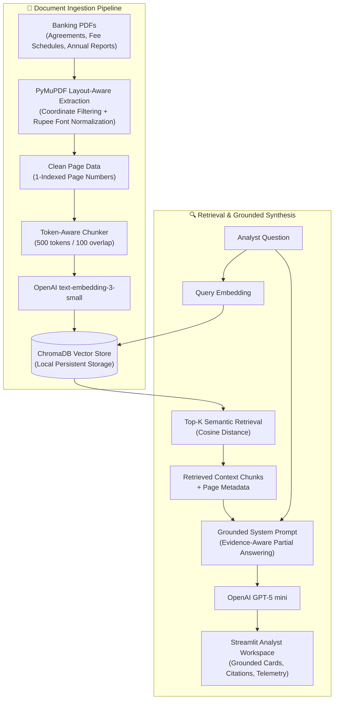

# 🏦 Banking Document Intelligence Assistant

A lightweight, source-grounded **Retrieval-Augmented Generation (RAG)** assistant for querying banking documents, commercial credit agreements, fee disclosures, and annual financial reports. Built natively in Python with **ChromaDB**, **PyMuPDF**, and **OpenAI**.

---

## 📌 Project Links

- **Live Application**: *[Live Demo — coming soon]*
- **Repository**: `https://github.com/your-username/banking-document-intelligence-assistant`

---

## 💼 Business Problem

Banking and investment analysts frequently work with lengthy annual reports (often 500+ pages), syndicated credit agreements, and complex regulatory disclosures. Manually locating specific clauses, fee waiver thresholds, covenant calculations, or balance sheet figures is time-consuming and error-prone.

General-purpose conversational AI models present significant risks in banking workflows because they can generate ungrounded answers or omit precise source citations. In financial analysis, every stated figure and term must be traceable directly to a specific document and page number, and systems must explicitly state when evidence is missing rather than speculating.

---

## 💡 Solution Overview

The **Banking Document Intelligence Assistant** is a document-grounded RAG application that:

1. **Ingests Banking PDFs**: Extracts clean, layout-aware text from multi-page PDFs using native PyMuPDF block coordinate sorting.
2. **Prunes Document Noise**: Filters out repetitive header/footer margins and normalizes legacy symbol font encodings.
3. **Preserves Page Metadata**: Chunks text with `tiktoken` while maintaining strict 1-indexed page boundaries for every chunk.
4. **Performs Dense Semantic Retrieval**: Stores embeddings in a persistent local Chroma collection (`text-embedding-3-small`, 1536 dimensions).
5. **Synthesizes Grounded Answers**: Uses OpenAI `gpt-5-mini` under a strict system prompt contract enforcing page-level citations (`[Document: name, Page: X]`).
6. **Supports Evidence-Aware Partial Answers**: When answering multi-part questions, cites all verified facts and explicitly declares which specific metrics were not found in the retrieved evidence.
7. **Enforces Compliance Refusal**: Returns an explicit insufficient-evidence response whenever context is missing or irrelevant.

---

## 🏗️ System Architecture



---

## 🛠️ Technology Stack

| Component | Technology | Role & Purpose |
| :--- | :--- | :--- |
| **Language** | Python 3.11 | Core application logic and typing |
| **PDF Extraction** | PyMuPDF (`pymupdf`) | Fast text extraction, block coordinate sorting, and font metadata inspection |
| **Vector Database** | Chroma (`chromadb`) | Embedded local vector database with persistent SQLite metadata storage |
| **Embedding Model** | OpenAI `text-embedding-3-small` | 1536-dimensional dense vector representations |
| **Reasoning Model** | OpenAI `gpt-5-mini` | Reasoning LLM for factual extraction, citation mapping, and partial answering |
| **Tokenizer** | `tiktoken` (`cl100k_base`) | Token-accurate chunk boundary splitting |
| **User Interface** | Streamlit | Web-based analyst workspace with responsive card layouts and source drawers |
| **Configuration** | `python-dotenv` | Centralized environment variable management |

---

## ✨ Key Features

- **Multi-PDF Batch Ingestion**: Upload and index multiple banking PDFs simultaneously with real-time indexing status and scanned-PDF alerts.
- **Strict Page-Level Citations**: Every factual statement is backed by `[Document: filename, Page: X]` citations.
- **Evidence-Aware Partial Answering**: For multi-metric questions where only a subset of facts is present in the document context, the assistant provides supported metrics with citations and explicitly declares which specific requested items were absent.
- **Compliance Guardrail Refusal**: Deliberately unanswerable or out-of-domain queries trigger a standardized insufficient-evidence notice.
- **Distinct Error Handling**: Network timeouts and OpenAI API exceptions are programmatically separated from document-level refusals.
- **Deterministic Rupee Font Normalization**: PDF extraction-layer remapping that resolves legacy symbol font artifacts (`ITFRupee`, `Rupee`) to standard `₹` without modifying underlying numerical values.
- **Source Evidence Explorer**: Expandable UI cards displaying source file, PDF page, chunk ID, retrieval role, cosine distance/similarity score, and verbatim context excerpts.
- **Telemetry & Benchmark Drawer**: Displays token consumption telemetry (prompt, completion, total) alongside offline benchmark performance metrics.

---

## 📊 Offline Evaluation & Benchmarks

The system was evaluated against a deterministic **15-question offline benchmark suite** (`eval/eval_questions.json`) designed to test direct factual retrieval, numerical figures, loan covenant conditions, multi-chunk synthesis, and out-of-domain refusals across sample banking documents.

> [!NOTE]
> These figures represent an offline development benchmark on a defined test set of 15 questions, not a statistical production accuracy guarantee.

| Metric | Benchmark Result | Notes |
| :--- | :---: | :--- |
| **Total Questions** | `15` | 11 answerable, 4 unanswerable/out-of-domain |
| **Retrieval Source Hit Rate** | **100.0%** (11/11) | Correct source document retrieved in Top-K for all answerable questions |
| **Retrieval Page Hit Rate** | **100.0%** (11/11) | Correct supporting page number retrieved in Top-K for all answerable questions |
| **Correct Refusal Rate** | **100.0%** (4/4) | Successfully returned insufficient evidence response for all unanswerable questions |
| **Overall Answer Match Rate** | **86.67%** (13/15) | Exact factual match against curated ground truth answers |

---

## 🔬 Retrieval Context Experiment ($K=2$ vs $K=4$ vs $K=6$)

A comparative retrieval experiment was conducted on the 15-question benchmark to evaluate the effect of context depth:

| Configuration | Top-K | Source Hit Rate | Page Hit Rate | Correct Refusal Rate | Answer Match Rate |
| :--- | :---: | :---: | :---: | :---: | :---: |
| **Lower Context** | $K=2$ | 100% (11/11) | 100% (11/11) | 100% (4/4) | 86.67% (13/15) |
| **Baseline** | $K=4$ | 100% (11/11) | 100% (11/11) | 100% (4/4) | 86.67% (13/15) |
| **Higher Context** | $K=6$ | 100% (11/11) | 100% (11/11) | 100% (4/4) | 86.67% (13/15) |

**Experiment Takeaway**: The $K=2/4/6$ experiment produced identical retrieval and answer-match metrics, indicating that simply increasing or decreasing retrieval depth did not resolve the observed generation failure cases (such as cross-page entity coreference). $K=4$ was retained as the practical baseline for context balance and token economy.

*(Note: Adjacent-page context augmentation was also implemented and evaluated as an optional capability. Because it expanded prompt context without altering benchmark match rates, it remains disabled by default in production configuration).*

---

## 📈 Real-World Document Stress Test: HDFC Annual Report

The system was evaluated against a real-world, 629-page annual report (`HDFC_FY26.pdf`, $17.75$ MB, $1.81$M characters):

- **Total Pages**: 629 total PDF pages.
- **Pages with Extractable Text**: 628 / 629 pages ($99.84\%$) contain extractable text with zero OCR required (exactly 1 blank divider page).
- **Total Chunks Generated**: 1,246 chunks (`chunk_size = 500`, `chunk_overlap = 100`, `filter_headers_footers = True`).
- **Average Chunk Size**: 392.64 tokens *(1,655.21 characters)*.
- **Metadata Integrity**: 100.00% (1,246 / 1,246 chunks valid with complete `source`, `page`, `chunk_id`, `chunk_text`, and `token_count`).
- **Header/Footer Coordinate Pruning**: Pruned repetitive running header and footer noise across 629 pages via configurable coordinate margins.
- **Deterministic Rupee Glyph Normalization**: Ingested PDFs using legacy font encodings (`ITFRupee` and `Rupee`) initially yielded raw ASCII artifacts like `(J Cr)`, `(I Cr)`, `(C crore)`, and `H Crore`. By inspecting font metadata during extraction, symbol glyphs are deterministically remapped to `₹` without modifying any numerical figures or inventing unit conversions.

---

## ⚠️ Known Limitations & Boundaries

1. **Complex 10-Column Financial Tables**: Pure text extraction flattens 2D tabular layouts into 1D text streams. Complex financial statements spanning multiple columns can lose cell-to-header relationships.
2. **Dense Semantic vs. Hybrid Retrieval**: Retrieval relies on dense vector similarity (`text-embedding-3-small`). Queries requiring exact alphanumeric account code lookups would benefit from hybrid keyword (BM25) + vector retrieval.
3. **Scanned PDF Processing**: The current pipeline detects and warns on scanned pages with low character counts, but does not include optical character recognition (OCR).
4. **Evaluation Scope**: The 15-question benchmark is a small offline evaluation suite. Enterprise deployment would require continuous evaluation across larger question sets.
5. **System Maturity**: This is a portfolio prototype and technical demonstration, not a production-certified banking compliance platform.

---

## 💬 Analyst & Technical Interview Talking Points

- **Why RAG instead of Fine-Tuning?** Fine-tuning updates model weights but cannot guarantee factual citation or prevent hallucinations on rapidly updating agreements. RAG separates knowledge retrieval from language reasoning, ensuring every answer is backed by verifiable document coordinates.
- **Why ChromaDB?** Chroma provides a lightweight, embedded vector store with persistent SQLite-backed metadata storage. It runs locally with zero infrastructure overhead while supporting exact metadata filtering.
- **Why Native Python instead of LangChain or LlamaIndex?** Building the ingestion, chunking, retrieval, and prompt pipeline directly in Python ensures complete architectural transparency, zero framework lock-in, deterministic control over prompts and citations, and clear explainability during technical audits.
- **Why Enforce Page-Level Chunk Boundaries?** Chunking across arbitrary page boundaries creates citation ambiguity. Maintaining strict 1-indexed page boundaries ensures that every retrieved chunk maps directly to a specific physical page in the PDF.
- **Why Evidence-Aware Partial Answering?** Real-world banking queries often ask for multiple metrics at once (e.g., Balance Sheet, Deposits, Advances, ROE, ROA, Net Revenue). Refusing the entire query when 5 out of 6 metrics are present creates poor analyst UX. Providing supported facts with citations while explicitly declaring missing items balances utility with strict compliance.
- **What breaks in production and what would you build next?** Production failure modes include complex table flattening and scanned image attachments. The next technical enhancements would be:
  1. Hybrid retrieval (BM25 + Dense Vectors) with Cross-Encoder reranking.
  2. Document intelligence vision parsing (LayoutLM / OCR) for multi-column tables.
  3. LLM-as-a-judge automated regression testing.

---

## 🚀 Local Setup & Installation

### 1. Prerequisites
- Python 3.11+
- OpenAI API Key

### 2. Installation

```bash
# Clone the repository
git clone https://github.com/your-username/banking-document-intelligence-assistant.git
cd banking-document-intelligence-assistant

# Create and activate a virtual environment
python3.11 -m venv .venv
source .venv/bin/activate

# Install dependencies
pip install -r requirements.txt
```

### 3. Environment Configuration

Create a `.env` file from the example template:

```bash
cp .env.example .env
```

Add your OpenAI API key to `.env`:

```ini
OPENAI_API_KEY=sk-your-actual-api-key-here
```

### 4. Run the Streamlit Application

```bash
streamlit run app.py
```

The application will be accessible in your browser at `http://localhost:8501`.

---

## 🧪 Verification & Benchmark Scripts

```bash
# Verify layout-aware PDF loader and unit tests
.venv/bin/python scripts/test_pdf_loader_layout.py

# Verify Streamlit session state and response rendering
.venv/bin/python scripts/verify_app_ui.py

# Run the 4-case evidence-aware partial answering suite
.venv/bin/python scripts/test_partial_grounding.py

# Run the 15-question offline benchmark suite
.venv/bin/python eval/run_eval.py
```

---

## 📷 Screenshots & Interface Artifacts

### 1. Source-Grounded Response with Verifiable Citations
*`[Screenshot Placeholder: Grounded response card showing exact metrics, page citations, and expandable source context]`*

### 2. Evidence-Aware Partial Answering & Missing Item Declaration
*`[Screenshot Placeholder: HDFC multi-metric query displaying 5 supported metrics with citations and explicit ROA absence notice]`*

### 3. System Telemetry & Offline Benchmark Drawer
*`[Screenshot Placeholder: Telemetry drawer displaying token usage alongside 15-question benchmark metrics]`*
